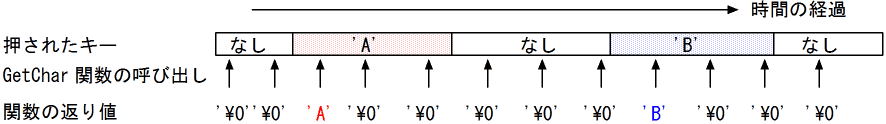
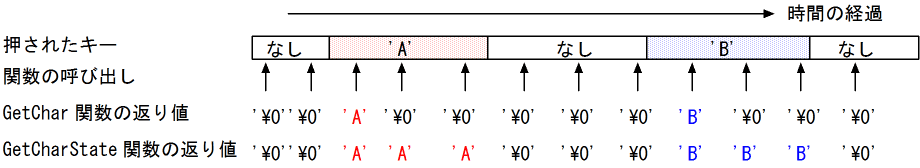

# 7週目制作物に関する資料

## 使用するデバイス
### 4×4キーパッド
[しなぷすのハード作成記](https://synapse.kyoto/product/keypad4X4FP/page001.html) に記事が書いてある。

### LEDマトリクス
8×8ドットLEDマトリクスのセルが4個連結されている

## 使用するArduinoライブラリ : 
**ResKeypad**
44キーパッドからの入力をArduinoが受け取れる形に変換していると思う。[こちら](https://synapse.kyoto/lib/ResKeypad/page001.html#index5)から導入できる。

**MaxMatrix2**
88LEDマトリクスを光らせるためのライブラリ。

## 回路
今回の回路は非常にシンプル。44キーパッドは、VCCとGNDをメインボードに繋ぎ、**OUTPUTをA4ピンに接続**。  
88LEDマトリクスは、**Dataを8pin、Loadを9pin、Clockを10pinに** それぞれ接続。

## 44キーパッドを構う
パッドの出力がボタンによって安定しない。今のところ、**4,5,6,B**が一番安定。  
一旦、この4つのボタンで画面上のドットを操作するプログラムを書いてみる。

※複数のキーを同時に押した時は、押したキーの内、1つだけを認識する仕組みになっています。キーには優先順位があり、SW番号の若いキーが優先的に認識されます。

### 関数に関して

[こちら](https://synapse.kyoto/product/keypad4X4/page003.html#index9_1)に関数の定義がある。

#### ResKeypad オブジェクトの生成
オブジェクト名 ``keypad`` として ResKeypadオブジェクトを生成

```
ResKeypad keypad(ain,16,RESKEYPAD_4X4);
```
ain は、44キーパッドのoutputの接続先ピン。第2引数は、キーパッドについているキーの数を指定します。第3引数には必ずRESKEYPAD_4X4を指定します。第4引数は、キーアサインを指定します。SIDE Aに部品を実装した場合はRESKEYPAD_4X4_SIDE_Aを、SIDE Bに部品を実装した場合はRESKEYPAD_4X4_SIDE_Bを指定します。

#### GetKey関数
押されたキーの番号を返す。キーが押されない場合は、-1を返す。  
**返り値の型 signed char**

#### WaitForKey関数
何かキーが押されるまで待ち、キーの番号を返す。
**返り値の型 signed char**

WaitForChar関数は、何かキーが押されるまで待ち、キーが押された瞬間に、そのキーに割り当てられる文字を返しますが、キーが押されるまでArduinoが停止してしまうという問題があります。そこで、キーが押されていない場合は、押されるまで待たずに、'\0'を返すことで、処理を続行できるようにしたのがGetChar関数です。


#### GetKeyState関数
キーパッドの状態を返す。現在押されているキーがある場合は、そのキーの番号を返し、現在何もキーが押されていない場合は-1を返す。
**返り値の型 signed char**

GetCharState関数は、現在押されているキーに対応した文字を返します。押されているキーがなければ'\0'を返します。キーが押されている間は、ずっとそのキーに対応した文字を返し続けるという点で、GetChar関数と異なります。


